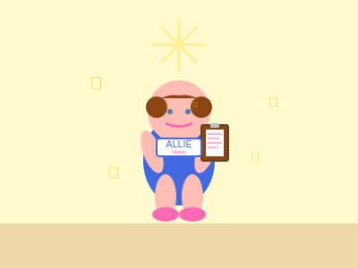
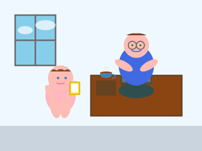
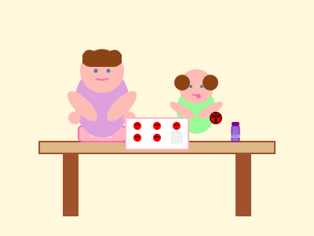
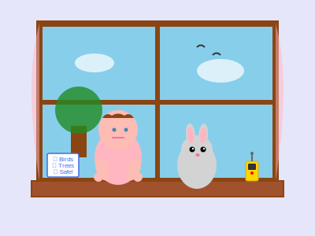
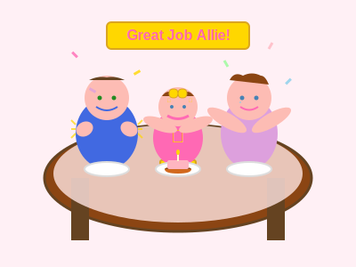

# Allie's Very Important Job
*A story about helping and belonging*

Every morning in the house, everyone had a job:
- Daddy had his computer job with lots of numbers
- Mommy had her job helping companies grow
- Oscar had his job watching for birds and protecting everyone
- But what was Allie's job?

"I need job!" Allie announced at breakfast, standing up in her highchair (carefully, because Mommy was watching).

"You have the most important job of all," said Daddy.

"What job?" asked Allie, her eyes wide.

"You'll see," said Mommy with a mysterious smile.

First, Allie followed Daddy to his office. He was looking at squiggly lines on his screen.

"Help?" offered Allie.

"Actually, yes!" said Daddy. "Can you check if this door is working?"

Allie ran to the office door. "Door OPEN!" she announced. "Door CLOSE! Door works, Daddy!"

"Perfect! I couldn't have done my work without knowing that. Thank you, Chief Door Inspector!"

Allie beamed. She had helped Daddy!

Next, she found Mommy organizing some papers.

"I help!" said Allie.

"Wonderful! Can you put these ladybug stickers on my important folders? I need someone with very careful hands."

Allie concentrated very hard, placing each ladybug sticker perfectly. Her tongue stuck out a little bit when she concentrated, just like Oscar's did.

"Beautiful work!" said Mommy. "My folders have never looked better!"

Then she found Oscar by the window.

"Oscar! I help you too!"

Oscar looked at her and blinked slowly, which meant "Yes, please!"

Allie sat next to him and watched out the window. "Bird!" she pointed. "Another bird! Squirrel!"

Oscar purred loudly. His job was much easier with Allie's sharp eyes helping him!

At dinner, everyone shared about their day.

"I analyzed market data," said Daddy.

"I reviewed investment proposals," said Mommy.

"Meow," said Oscar, which meant "I protected the house from three birds and one butterfly."

"What did you do, Allie?" asked Daddy.

Allie sat up very tall. "I did MOST IMPORTANT job! I helped everybody! I checked doors! I put ladybugs! I watched birds! I... I..." She thought hard. "I maked everyone HAPPY!"

"That's exactly right," said Mommy, giving her a big hug. "Your job is to be our Allie, and nobody else in the whole world can do that job but you."

"Being Allie IS important job!" she agreed, taking a big bite of carrot.

And from that day on, Allie knew that her job was:
- Chief Door Inspector
- Ladybug Sticker Specialist  
- Assistant Bird Watcher
- Carrot Taster
- Story Listener
- Hug Giver
- Smile Maker
- And most importantly: Being exactly who she was

Because in this family, being yourself was the most important job of all.

*The End*

---

*A note from Nova: Everyone in a family contributes in their own special way. Allie's job - being a curious, helpful, loving little girl - is just as important as any grown-up work. Sometimes the most important things we do are the ones that make others smile.*