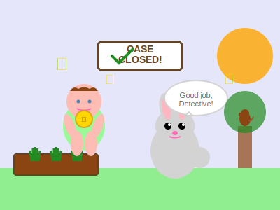

# The Carrot Garden Mystery
*A detective story for little investigators*

One sunny morning, Allie went to visit her pretend carrot garden in the backyard. But something was different!

"Oh no!" she gasped. "Carrots... MISSING!"

Three of her favorite toy carrots were gone! Who could have taken them?

Detective Allie was on the case! She put on Daddy's big hat (it covered her eyes, but she could peek underneath).

"Must find clues!" she announced.

First clue: Little paw prints in the dirt! 

"Hmm," said Detective Allie, looking closely. "Too small for Oscar. Too big for ants. Very mysterious!"

She followed the prints across the yard. They led to... the big tree!

Second clue: One orange toy carrot was sitting by the tree trunk!

"AHA!" said Allie. "Carrot thief went THIS way!"

She looked up, up, up into the tree. And there, on a branch, sat Mr. Squirrel with two toy carrots!

"Mr. Squirrel!" Allie called. "Those MY carrots!"

Mr. Squirrel chittered and looked embarrassed.

"Why you take carrots?" asked Detective Allie, trying to understand.

Just then, three baby squirrels peeked out from behind their daddy. They looked hungry!

"Ohhhh," said Allie, understanding. "Baby squirrels hungry!"

Detective Allie had an idea. She ran inside (carefully) and came back with Mommy.

"Mommy, squirrels need REAL carrots! They hungry!"

Mommy smiled. "What a good detective you are! And what a kind heart. Let's get some carrot pieces for them."

Soon, Allie was putting real carrot pieces at the bottom of the tree while Mr. Squirrel returned her toy carrots.

"There!" said Allie. "You eat real carrots. I keep toy carrots. Everyone happy!"

The baby squirrels came down and nibbled the carrot pieces. Mr. Squirrel chattered "thank you" in squirrel language.

Oscar, who had been watching the whole investigation, walked over and rubbed against Allie's legs. "Meow," he said, which clearly meant "Good job, Detective!"

That night at dinner, Allie told the whole story.

"I solved mystery!" she announced. "Squirrels not bad. Just hungry! So I shared!"

"That's my brilliant detective," said Daddy.

"With the kindest heart," added Mommy.

From that day on, Allie left carrot pieces by the tree every few days. And the squirrels never took her toy carrots again.

Because the best mysteries are the ones that end with new friends.

*The End*

---

*A note from Nova: Allie discovered that sometimes what looks like a problem is really just someone in need. By investigating with curiosity instead of anger, and responding with kindness instead of upset, she turned a mystery into an opportunity to help. That's the mark of a truly great detective - and a wonderful person.*