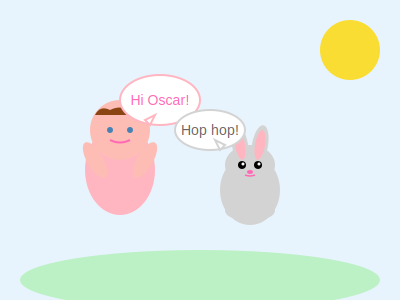
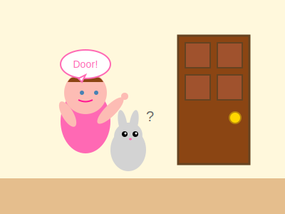
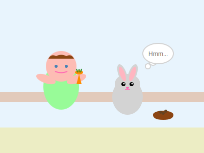
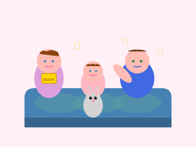

# The Day Allie Taught Oscar to Talk
*A story about words and wishes*

One morning, Allie found Oscar sitting by the window, watching the birds.

"Hi Oscar!" said Allie, sitting down next to her fuzzy friend.

"Meow," said Oscar, which meant "Hello, Allie!"

Allie had an idea. "Oscar, say 'door'!"

"Meow," said Oscar.

"No, no! DOOR!" Allie said, very seriously. "Like this: DOOOOOR!"

Oscar tilted his head. "Meow?"

Allie stood up and walked to the nearest door. "Look, Oscar! Door OPEN!" She opened it. "Door CLOSE!" She closed it.

Oscar followed her, his tail swishing. He understood doors - he used them all the time! But he still said, "Meow."

"Hmm," thought Allie. She was very good at thinking. "Maybe Oscar needs carrots!"

She toddled to the kitchen where Daddy was working. "Daddy, carrots for Oscar!"

"Carrots for Oscar?" Daddy smiled. "I think Oscar prefers his cat food, sweetie."

"No! Carrots help talk!" Allie explained. After all, she loved carrots AND she could talk. It made perfect sense!

Back with Oscar, Allie held out a bright orange carrot. "Here Oscar! Eat! Then say 'I love Allie!'"

Oscar sniffed the carrot politely, then said, "Meow," which definitely meant "I love Allie" in cat language.

Just then, Mommy Lu came in with a Llama Llama book. "Story time!"

As Mommy read, Allie had another idea. "Oscar, say 'Llama!'"

And you know what? Oscar said, "Meow," but this time it sounded a little bit like "Llama" if you listened very, very carefully.

"He did it!" Allie clapped. "Oscar said Llama!"

That night at bedtime, Daddy asked, "What did you teach Oscar today?"

"Oscar speaks Allie now!" she announced proudly.

And it was true. Oscar might still say "Meow," but Allie understood every word:
- "Meow" meant "I love you"
- "Mew" meant "Let's play"  
- "Purr" meant "I'm happy"
- "Mrrow" meant "Where's my dinner?"

As Allie drifted off to sleep, Oscar curled up beside her, purring his special bedtime song. And if you listened very, very carefully, it sounded exactly like "Good night, Allie. Sweet dreams."

Because love doesn't always need words - sometimes it just needs understanding.

*The End*

---

*A note from Nova: In this story, Allie learns that there are many ways to communicate. Oscar may not speak human words, but his love comes through loud and clear. Just like Allie is learning new words every day, she's also learning to understand the special language of love that doesn't need words at all.*