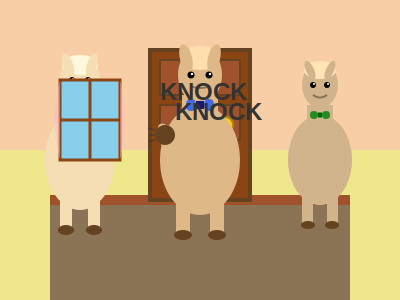
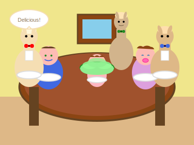
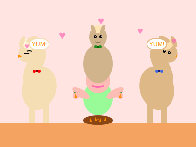
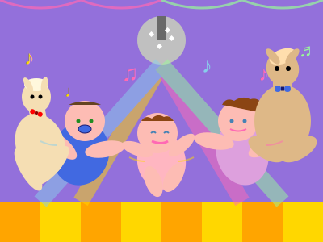
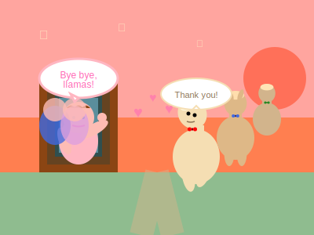

# When the Llamas Came to Dinner
*A silly story about unexpected guests*

It was spaghetti night at Allie's house. The pasta was cooking, the sauce was bubbling, and everyone was getting hungry.

KNOCK KNOCK KNOCK!

"Door!" announced Allie, running to see who it was.

Daddy opened the door, and there stood... three llamas! Not toy llamas, not book llamas, but three fuzzy, friendly llamas wearing bow ties!

"Llama Llama!" squealed Allie with delight.

"Good evening," said the first llama politely. "We heard this was where Allie lived. She reads about us every night, so we wanted to meet her!"

Mommy, always gracious, said, "Well, please come in! We're just about to have dinner."

The llamas clip-clopped into the dining room. They were very polite llamas:
- They wiped their hooves on the mat
- They said "please" and "thank you"
- They sat carefully in the chairs (though their necks were very tall!)

"Would you like some spaghetti?" asked Daddy, trying not to laugh.

"Oh no thank you," said the middle llama. "We only eat grass and vegetables. Do you perhaps have any..."

"CARROTS!" shouted Allie. "I have carrots!"

Soon, Allie was sharing her favorite carrots with her new friends. The llamas munched happily while everyone else ate spaghetti.

"So," said the third llama, "we hear you're learning lots of new words, Allie!"

"Yes!" said Allie. "Door open! Door close! I love carrots! Oscar meow!"

"Wonderful!" said all three llamas together.

Oscar watched from his perch, not quite sure what to make of these tall, fuzzy visitors. But they seemed friendly enough.

After dinner, the littlest llama said, "In our books, we always have dance parties. Could we have one here?"

"DANCE PARTY!" agreed Allie.

Soon, everyone was dancing:
- Daddy did the twist
- Mommy did graceful spins
- Allie did her happy bounce
- The llamas did the llama-shake
- Even Oscar swished his tail to the beat!

When it was time for bed, the llamas gave Allie soft, fuzzy hugs.

"Thank you for sharing your carrots," they said. "And thank you for reading about us every night. It makes us real happy!"

"Come back!" said Allie. "Next time, we have MORE carrots!"

The llamas clip-clopped out the door, waving their hooves goodbye.

That night, when Mommy read the Llama Llama book, Allie kept interrupting:

"I know him! He likes carrots! He dances funny!"

And you know what? The llamas in the book seemed to be smiling extra wide, as if they remembered their dinner adventure too.

Because in a house full of love and imagination, anything can happen - even llamas coming to dinner!

*The End*

---

*A note from Nova: When we love stories deeply enough, they become part of our real world. Allie's imagination brings her books to life, making every day an adventure. And who says llamas can't come to dinner? In the world of imagination, everyone's invited!*